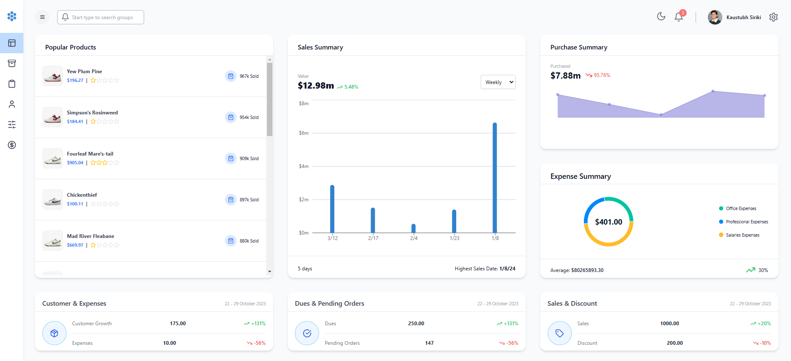

 <h1 align="center">Inventory Management App</h1>   
  </img> 
   

## Introduction
 
Welcome to the Inventory Management App, a foundational inventory tracking and management application designed to explore and strengthen backend development skills in PostgreSQL and AWS.

## Deployment

**Warning:** This app is in its early stages of development and may lack advanced features. It may also take a few seconds to load due to server initialization.
The project is hosted on AWS. You can view the live site here: [Inventory Management App](https://main.d98dv5jozbm71.amplifyapp.com/dashboard)

## Features
- **Dashboard:** Displays key metrics and a summary of inventory, users, and products in a user-friendly interface.
- **Add Inventory:** Easily add new inventory items to maintain accurate records.
- **Categorization:** Organize inventory items into categories for better structure and filtering.
- **Search Inventory:** Quickly locate specific items with a responsive search feature.
- **User Management:** Manage basic user details for better organization.
- **Product Management:** Maintain a simple product catalog for tracking purposes.
- **Responsive Design:** Optimized for all device types, ensuring smooth operation on desktops, tablets, and mobile devices.

## Technologies
- **Frontend:** Next.js, Tailwind CSS, Redux Toolkit
- **Backend:** Node.js, Prisma, PostgreSQL 17
- **Cloud Hosting:** AWS EC2, AWS RDS, AWS S3
- **API:** RESTful API for data exchange between frontend and backend

## Learning Experience
This project allowed me to focus on developing backend skills, particularly with PostgreSQL for database management and AWS services like EC2, RDS, and S3 for cloud deployment. While the system is functional, it is a work-in-progress, providing valuable lessons in building scalable, cloud-hosted applications.

## Conclusion
The Inventory Management App represents a stepping stone in my learning journey. While it is not yet feature-complete, it highlights my commitment to improving backend and cloud development skills. Feel free to explore the project and reach out with any feedback or questions.

 <strong>- Kaustubh Siriki</strong> 
